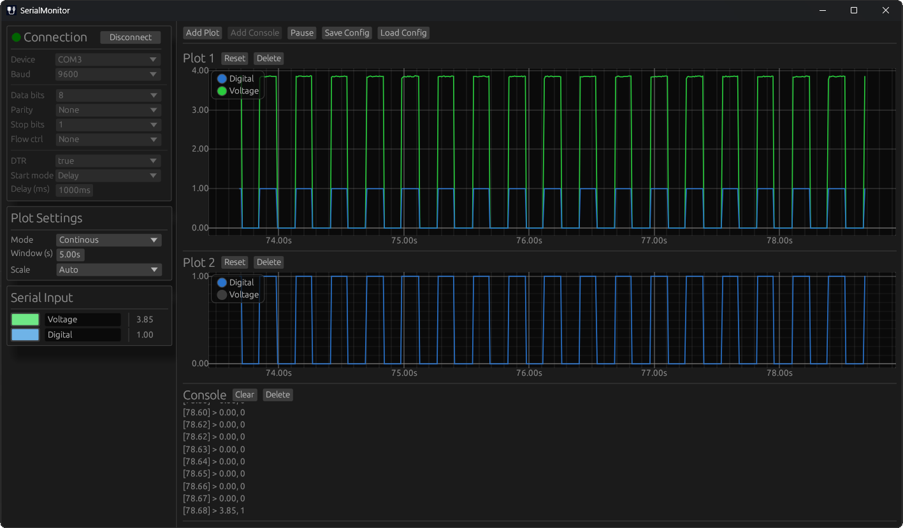

# Serial Monitor
A Rust 1.77.1 application for reading and displaying serial data from devices like Arduino.
Configurations can be passed via the command line to quickly connect and prepare the application for a specific device.



## Dependencies
The repo contains a cargo project to build the application. Run `cargo build [--release]` in the root of the repository to compile an exe.
All dependencies are available on github and crates.io:
- [egui/eframe](https://github.com/emilk/egui) for window creation and UI
- [serialport-rs](https://github.com/serialport/serialport-rs) to connect to serial ports
- [clap](https://github.com/clap-rs/clap) for command line parsing
- [rfd](https://github.com/PolyMeilex/rfd) to create native file dialogs
- [image](https://github.com/image-rs/image) to load the icon
- [serde](https://github.com/serde-rs/json) to save/load configs as json

## Command line
```bash
serial_monitor.exe --config "PATH TO CONFIG .JSON" --connect
--config <CONFIG>   # Path to a json file containing a saved configuration
--connect [-c]      # Try to connect to the port from the configuration
```

## Information
- Depending on the device, reading valid data will not be possible immediately after connecting! Change the start mode to wait for a short time or use a specific start message to notify the monitor that your device is ready.
- Data sent by the serial device has to be in ASCII character format. The monitor reads data line by line to separate entries.
- To send multiple values for each entry, values have to be separated by ','
- Variable value counts for entries are not supported!
- Plots are read only while data is being read. When paused, the graphs can be dragged with `LMB` and zoomed with `Ctrl` + `Mouse wheel`.
- Pausing will not suspend data reading! Only displaying is paused and the read values are discarded. After continuing, there will be a gap in the displayed data.
